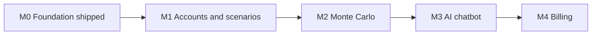

# Roadmap

This is the **living roadmap** for Financial Planner — the source of truth for what ships next. It sits on top of the system design in [`docs/architecture.md`](docs/architecture.md) and links back to the per-feature archived plans in [`docs/plans/`](docs/plans/). The shipping process itself is in [`.cursor/rules/workflow.mdc`](.cursor/rules/workflow.mdc).

Last updated: **2026-04-24** — see [Change log](#change-log).

## At a glance

- `[x]` **M0 — Foundation** (shipped `b7d8b9d`) — production deploy at [planner.boombaleia.com](https://planner.boombaleia.com), observability wired, shared `@app/core`.
- `[ ]` **M1 — Accounts and scenarios** — Supabase Auth + named scenarios with RLS + consent banner.
- `[ ]` **M2 — Monte Carlo** — stochastic engine in `@app/core`, Web Worker, fan chart, success gauge.
- `[ ]` **M3 — AI chatbot** — streaming assistant that explains results and safely mutates the current scenario via Zod-typed tools.
- `[ ]` **M4 — Billing** — Stripe subscriptions, feature gates for MC path-count and AI message quota.

## Legend

- **shipped** — merged to `main` and running in production.
- **in progress** — a feature branch or PR exists and is actively being worked on.
- **planned** — scoped here but not yet started.

---

## M0 — Foundation

**Status:** shipped (commit [`b7d8b9d`](https://github.com/lejeff/financial-planner/commit/b7d8b9d) · 2026-04-23).

**Goal:** get the deterministic planner running in production on the commercial stack, with observability and a shared core package ready for M1–M4.

**What actually shipped:**

- Shared domain package [`packages/core/`](packages/core/) with `PlanInputsSchema` (Zod) + `projectNetWorth` — consumed by `app/` via `@app/core` workspace symlink.
- Strict three-zone env validation: [`app/src/lib/env.ts`](app/src/lib/env.ts) (public) and [`app/src/lib/env.server.ts`](app/src/lib/env.server.ts) (server-only, `import "server-only"`).
- Vercel production + preview deploys; serverless functions pinned to `fra1` via [`vercel.json`](vercel.json).
- Supabase project scaffolded — [`supabase/config.toml`](supabase/config.toml), empty init migration at [`supabase/migrations/20260424000000_init.sql`](supabase/migrations/20260424000000_init.sql).
- Sentry wired across client/server/edge runtimes; release tagged with `VERCEL_GIT_COMMIT_SHA`.
- PostHog EU Cloud behind a first-party `/ingest` reverse proxy ([`app/next.config.ts`](app/next.config.ts)); `persistence: "memory"` until the M1 consent banner lands.
- CI: lint, typecheck, unit tests, build, E2E smoke ([`.github/workflows/ci.yml`](.github/workflows/ci.yml)).

**Cross-refs:** [architecture.md §2.1 §2.8 §2.9](docs/architecture.md) · [docs/plans/2026-04-24-mid-term-core-features.md](docs/plans/2026-04-24-mid-term-core-features.md) (original M0 scope).

---

## M1 — Accounts and scenarios

**Status:** planned.

**Goal:** signed-in users own a list of named financial scenarios persisted in Supabase Postgres, with Row-Level Security enforcing tenant isolation in the database itself.

**Success criteria:**

- Magic-link sign-in works end-to-end with Supabase Auth + Resend delivery.
- `/scenarios` list, `/scenarios/[id]` editor, and `/scenarios/new` render only for the signed-in user; anonymous users still see the single-plan localStorage flow.
- A Playwright test using two distinct accounts confirms RLS prevents cross-user reads and writes on the `scenarios` table.
- Anonymous `planner.inputs.v1` localStorage blob migrates to a default-named scenario on first sign-in, and never migrates twice.
- PostHog flips from `persistence: "memory"` to `"localStorage"` **only** after the consent banner is accepted.

**Key deliverables:**

- `middleware.ts` using `@supabase/ssr` to refresh sessions on every request.
- Routes: `(auth)/sign-in`, `(auth)/sign-up`, `/auth/callback/route.ts` (PKCE exchange).
- Supabase migrations for `profiles` (keyed by `auth.users.id`) and `scenarios (id, user_id, name, inputs jsonb, created_at, updated_at, archived_at)` — each with RLS policies on the same migration, never in a follow-up.
- `PlanRepository` + `ScenarioRepository` interfaces in `@app/core` with `LocalStoragePlanRepository` and `SupabaseScenarioRepository` adapters; feature components depend on the interface, not Supabase directly.
- Scenario switcher UI + debounced autosave (500ms) with a visible "saved" indicator.
- Consent banner component that writes choice to localStorage and toggles PostHog persistence at runtime.
- Resend transactional email template + server-side sender for magic links.

**Cross-refs:** [architecture.md §2.4 §2.5 §2.7 §3.2 §3.3](docs/architecture.md) · [docs/plans/2026-04-24-mid-term-core-features.md](docs/plans/2026-04-24-mid-term-core-features.md) (original M1 + M2) · [app/src/features/auth/](app/src/features/auth/).

---

## M2 — Monte Carlo

**Status:** planned.

**Goal:** stochastic projection with seeded reproducibility running off the main thread, rendered as a fan chart with a success-probability gauge.

**Success criteria:**

- A 10k-path, 40-year simulation completes in < 1s on a mid-range laptop.
- Identical `(seed, inputs)` pairs produce byte-identical output (asserted in Vitest).
- Fan chart (P10/P50/P90) and success-probability gauge render on the scenario page.
- The scenarios list view shows each scenario's cached success probability without re-running the simulation.

**Key deliverables:**

- Pure `packages/core/src/monteCarlo.ts` — returns `{ paths, percentiles, successProbability }` from `PlanInputs` + stochastic assumptions (return mean/volatility, inflation distribution, correlations, path count, seed).
- `app/src/features/planner/monteCarlo.worker.ts` — Web Worker wrapping the core engine.
- `useMonteCarlo(inputs)` React hook with debounce + stale-run cancellation.
- `MonteCarloPanel` component (fan chart, gauge, terminal-wealth distribution) using Recharts.
- Migration adding `last_simulation jsonb` column to `scenarios` caching percentiles + success probability (not raw paths).

**Cross-refs:** [architecture.md §3.4](docs/architecture.md) · [packages/core/src/](packages/core/src/).

---

## M3 — AI chatbot

**Status:** planned.

**Goal:** an in-app assistant scoped to the signed-in user's current scenario — explains metrics and results, and can safely mutate inputs or trigger a re-simulation via typed tool calls.

**Success criteria:**

- Responses stream token-by-token in the chat drawer.
- Every tool call that writes to the DB is Zod-validated against `PlanInputsSchema` (from `@app/core`) before persistence — no separate "AI write path".
- Chat history is per-scenario, persists across reloads, and is isolated via RLS (cross-account test passes).
- Rate-limiter on `/api/chat` prevents per-user flooding (Upstash or Vercel KV).

**Key deliverables:**

- `app/src/app/api/chat/route.ts` — streaming `streamText` handler from Vercel AI SDK, system prompt composed server-side from the scenario + cached simulation.
- Three tools sharing `ScenarioRepository` from M1: `updateScenarioInputs(patch)`, `runMonteCarlo()`, `explainMetric(metricId)` (last one returns pre-authored copy to prevent hallucinated definitions).
- `chat_messages (id, scenario_id, user_id, role, content, tool_calls, created_at)` migration with RLS.
- Chat drawer UI with streaming messages, tool-call chips, and an "Apply all suggestions" diff-based apply button.
- Env additions: `OPENAI_API_KEY` or `ANTHROPIC_API_KEY` in [`app/src/lib/env.server.ts`](app/src/lib/env.server.ts) and [`.env.example`](.env.example).

**Cross-refs:** [architecture.md §2.10](docs/architecture.md).

---

## M4 — Billing

**Status:** planned.

**Goal:** paid tier gates the compute-heavy features (Monte Carlo path-count, AI message quota), monetizing the parts that actually cost money.

**Success criteria:**

- Checkout redirects to Stripe and returns to the app with an active subscription within 5s of webhook delivery.
- Middleware blocks gated routes for free users with a friendly upgrade CTA — no partial/broken-feature states.
- Customer portal link from `/settings/billing` works end-to-end (update card, cancel, reactivate).
- Subscription state is derived from Stripe webhooks only — no polling, no duplicate source-of-truth.

**Key deliverables:**

- Real implementations of [`app/src/app/api/billing/checkout/route.ts`](app/src/app/api/billing/checkout/route.ts) and [`app/src/app/api/webhooks/stripe/route.ts`](app/src/app/api/webhooks/stripe/route.ts) (both currently stubs).
- `subscriptions` migration with RLS; derived view `v_user_entitlements` joining auth → subscription state → feature flags.
- `useEntitlement(feature)` hook + server equivalent for route guards.
- `/settings/billing` page with customer portal link and current-plan summary.
- Rate-limit raised for paid users on `/api/chat` (see M3).

**Cross-refs:** [architecture.md §2.6 §3.5](docs/architecture.md).

---

## Cross-cutting quality gates

These apply to **every** PR that lands under any milestone. Distilled from the original mid-term plan.

- Every pure function in `@app/core` lands with a Vitest unit test. Every feature UI path lands with a component test in `app/src/**/*.test.tsx`. Every user-visible flow gets one Playwright happy-path spec.
- Every DB change is a single migration file in [`supabase/migrations/`](supabase/migrations/), including its RLS policy. Never introduce a table without RLS in the same migration.
- Every new `.env` key is added to the Zod schema in [`app/src/lib/env.ts`](app/src/lib/env.ts) or [`app/src/lib/env.server.ts`](app/src/lib/env.server.ts) **and** to [`.env.example`](.env.example) in the same PR.
- Security headers in [`app/next.config.ts`](app/next.config.ts) stay strict. Every new third-party origin (AI provider, Stripe, etc.) gets its CSP entry audited before the milestone merges.
- Ship workflow in [`.cursor/rules/workflow.mdc`](.cursor/rules/workflow.mdc) is followed: lint + typecheck + test local, pause for manual dev-server test, then commit/push/merge.

## How to keep this doc fresh

- **When a milestone ships:** flip its checkbox in [At a glance](#at-a-glance), change its status header to `shipped` with the squash-merge commit SHA, append an entry to the [Change log](#change-log).
- **When scope moves between milestones:** edit the relevant success-criteria and deliverables bullets, and add a dated change-log entry explaining the move.
- **When a new plan lands in [`docs/plans/`](docs/plans/):** add a cross-ref bullet in the relevant milestone section so the detailed plan and the roadmap stay linked.
- **When architecture changes:** cross-check [`docs/architecture.md`](docs/architecture.md) uses the same milestone numbers, and regenerate its rendered artifacts with `npm run docs:build`.

## Change log

Append-only, newest first. One line per material change.

- **2026-04-24** — Document created. Reconciles the original five-milestone mid-term plan (M0–M4) and the architecture doc's three-milestone numbering (M0–M3) into a single forward-looking roadmap: M0 (shipped) + M1 Accounts and scenarios + M2 Monte Carlo + M3 AI chatbot + M4 Billing. Billing split out of the architecture doc's old M3 into its own milestone.
