<div class="title-block">

<p class="doc-title">Financial Planner — Architecture</p>
<p class="doc-sub">Services, data flows, shipping workflow, and data model</p>
<p class="doc-meta">Production: <a href="https://planner.boombaleia.com">planner.boombaleia.com</a> &nbsp;·&nbsp; Source of truth: <code>docs/architecture.md</code></p>

</div>

## Status badges used throughout this document

<span class="badge badge-active">ACTIVE</span> running today in production at `planner.boombaleia.com`.  
<span class="badge badge-dormant">WIRED-DORMANT</span> code and configuration are shipped, but the service is idle until a credential (DSN / API key / secret) is added to Vercel. Turning it on is a one-variable change, no redeploy needed if configured at the project level.  
<span class="badge badge-planned">PLANNED</span> not yet built. The M1 / M2 / M3 / M4 tag indicates the milestone that introduces it.

---

## Table of contents

1. [System overview](#system-overview)
2. [Services and what each one captures](#services-and-what-each-one-captures)
3. [Data flows (sequence diagrams)](#data-flows-sequence-diagrams)
4. [Data model](#data-model)
5. [How a new feature is shipped](#how-a-new-feature-is-shipped)
6. [Environments and configuration](#environments-and-configuration)
7. [Security, privacy, data residency](#security-privacy-data-residency)
8. [Cost model](#cost-model)
9. [Glossary and further reading](#glossary-and-further-reading)

---

## System overview

Financial Planner is a single-tenant-per-user web application: each signed-in user owns a set of financial scenarios, runs deterministic projections plus probabilistic Monte Carlo simulations on them, and (from M3) can query an AI assistant scoped to their own numbers.

The stack is intentionally small and boring: **Next.js 15 App Router on Vercel** as the runtime; **Supabase Postgres** as the database with **Row-Level Security (RLS)** enforcing tenant isolation in the database itself; **Stripe** for billing; **Sentry + PostHog** for observability. Everything that stores user data runs in the EU (Frankfurt) for GDPR simplicity.

### Context diagram

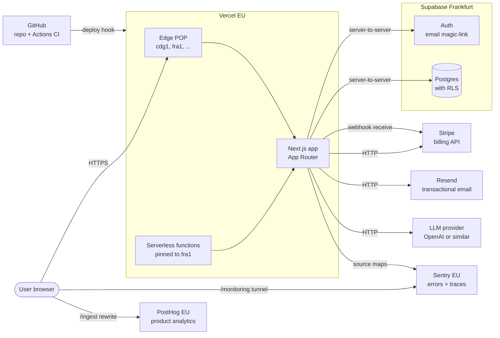

The shaded `Vercel EU` and `Supabase Frankfurt` groups are the two stateful / compute-heavy substrates; everything else is a stateless third-party used from Next.js server code or directly from the browser via a first-party proxy path.

---

## Services and what each one captures

| Service | Purpose | Region | Data captured | Status |
| --- | --- | --- | --- | --- |
| **Vercel** | Hosting + CDN + serverless runtime | Edge global, functions `fra1` | Access logs (IP, URL, status), build logs | <span class="badge badge-active">ACTIVE</span> |
| **Next.js app** | UI, server actions, API routes | Runs inside Vercel | Request lifecycle only (nothing persisted by default) | <span class="badge badge-active">ACTIVE</span> |
| **`@app/core` package** | Pure domain logic (schema + projection math) | N/A (library) | Nothing; it's pure functions | <span class="badge badge-active">ACTIVE</span> |
| **Supabase Auth** | User sign-in (email magic-link) | Frankfurt | Email, hashed password (if used), session rows | <span class="badge badge-planned">PLANNED (M1)</span> |
| **Supabase Postgres** | Scenarios, simulations, subscriptions, chat history | Frankfurt | All durable user content | <span class="badge badge-planned">PLANNED (M1)</span> |
| **Stripe** | Subscription billing | US (PCI-scoped) | Customer record, subscription state, payment methods | <span class="badge badge-planned">PLANNED (M4)</span> |
| **Resend** | Transactional email | EU | Email delivery logs (from, to, subject, status) | <span class="badge badge-planned">PLANNED (M1)</span> |
| **Sentry** | Error + performance telemetry | EU | Exception stack traces, perf spans, release metadata | <span class="badge badge-dormant">WIRED-DORMANT</span> |
| **PostHog** | Product analytics | EU Cloud | `$pageview`, `$pageleave`, explicit `capture(...)` calls | <span class="badge badge-dormant">WIRED-DORMANT</span> |
| **LLM provider** | AI assistant | US most likely | User prompts, scenario numbers, assistant replies | <span class="badge badge-planned">PLANNED (M3)</span> |
| **GitHub** | Source of truth + CI | Global | Source code, CI logs, PR metadata | <span class="badge badge-active">ACTIVE</span> |
| **Gandi.net** | DNS authoritative for `boombaleia.com` | Global | Only `planner` CNAME → Vercel | <span class="badge badge-active">ACTIVE</span> |

### 2.1 Vercel <span class="badge badge-active">ACTIVE</span>

Hosts the Next.js app. Static assets are served from the global edge network (whichever POP is closest to the user — verified `cdg1` for requests from France). Serverless functions are pinned to `fra1` via [`vercel.json`](../vercel.json) so they execute geographically next to Supabase:

```json
{ "regions": ["fra1"], "framework": "nextjs", "installCommand": "npm install" }
```

Vercel auto-deploys `main` to production and every pull request to a preview URL. It also provisions and renews the TLS certificate for `planner.boombaleia.com`.

**What it sees:** access logs (IP, URL, status, UA, response time), function invocation logs, build logs. No user data goes through Vercel storage — it's a pure pass-through.

### 2.2 Next.js app <span class="badge badge-active">ACTIVE</span>

App Router layout, Client + Server Components, server actions, and a handful of API routes:

- [`app/src/app/page.tsx`](../app/src/app/page.tsx) — landing + planner UI
- [`app/src/app/api/billing/checkout/route.ts`](../app/src/app/api/billing/checkout/route.ts) — creates a Stripe Checkout session
- [`app/src/app/api/webhooks/stripe/route.ts`](../app/src/app/api/webhooks/stripe/route.ts) — receives Stripe webhook events
- [`app/src/app/global-error.tsx`](../app/src/app/global-error.tsx) — top-level error boundary that reports to Sentry
- [`app/src/instrumentation.ts`](../app/src/instrumentation.ts) — Next.js instrumentation hook initializing Sentry on boot

Feature code is organised under `app/src/features/{planner,currency,auth,billing,projects,settings}/` so each concern has its own folder and tests.

### 2.3 `@app/core` package <span class="badge badge-active">ACTIVE</span>

A separate npm workspace at [`packages/core/`](../packages/core/) that owns the domain model and financial math. It has no React, no environment access, no I/O — making it trivially unit-testable (131/131 passing in CI) and reusable across:

- the client bundle (forms and charts)
- server actions (validation before persistence)
- future Supabase Edge Functions (if we ever run projections server-side at scale)
- the AI assistant's tool layer (`runProjection` as an LLM tool)

Exports: `PlanInputsSchema`, `PlanInputs`, `ProjectionPoint`, `DEFAULT_PLAN_INPUTS`, `projectNetWorth`, `deflateToToday`, `ageFromDob`, `clampHorizon` (see [`packages/core/src/index.ts`](../packages/core/src/index.ts)).

### 2.4 Supabase Auth <span class="badge badge-planned">PLANNED (M1)</span>

Hosted Postgres project in Frankfurt (region `eu-central-1`) with the built-in **GoTrue** auth service. Plan: email magic-link as the primary sign-in method; OAuth (Google) as a stretch goal.

**What it will capture:** email address, hashed password if one is set, per-device refresh tokens, audit log (sign-in timestamps + IPs) that Supabase retains for 90 days by default.

Session is transported via an HttpOnly cookie set by `@supabase/ssr` so both Server Components and Route Handlers can read it. No long-lived JWT ever enters `localStorage`.

### 2.5 Supabase Postgres <span class="badge badge-planned">PLANNED (M1)</span>

Same Supabase project. **Row-Level Security (RLS) is the primary tenant-isolation mechanism** — every table has an `owner_id uuid references auth.users(id)` column and a policy of the form:

```sql
alter table scenarios enable row level security;
create policy "users read own scenarios"  on scenarios for select using (auth.uid() = owner_id);
create policy "users write own scenarios" on scenarios for all    using (auth.uid() = owner_id);
```

With RLS enabled, even a bug that accidentally queries `select * from scenarios` without a `where` clause is safe: Postgres silently filters to the current user's rows.

See the full planned schema in [Data model](#data-model).

### 2.6 Stripe <span class="badge badge-planned">PLANNED (M4)</span>

Checkout-hosted flow (no PCI scope on our side). The checkout route is already scaffolded at [`app/src/app/api/billing/checkout/route.ts`](../app/src/app/api/billing/checkout/route.ts). Webhook signatures are verified with `STRIPE_WEBHOOK_SECRET` in [`app/src/app/api/webhooks/stripe/route.ts`](../app/src/app/api/webhooks/stripe/route.ts).

**What it will capture:** customer record (id, email), subscription state, payment method metadata, invoices. We never see raw card data.

### 2.7 Resend <span class="badge badge-planned">PLANNED (M1)</span>

Transactional email: welcome / magic-link / password-reset (if we offer a password path) / billing receipts. EU region. DKIM + DMARC records live on Gandi alongside the `planner` CNAME.

**What it will capture:** message metadata only (from, to, subject, delivery status). Content of the emails is rendered from templates in `app/src/features/auth/emails/` and kept deliberately short to minimise PII exposure.

### 2.8 Sentry <span class="badge badge-dormant">WIRED-DORMANT</span>

Error + performance telemetry, EU region (`ingest.de.sentry.io`). The SDK is fully wired but dormant until `NEXT_PUBLIC_SENTRY_DSN` is set in Vercel — see [`app/src/instrumentation.ts`](../app/src/instrumentation.ts) (server + edge), [`app/src/instrumentation-client.ts`](../app/src/instrumentation-client.ts) (browser), and the `withSentryConfig` wrapper in [`app/next.config.ts`](../app/next.config.ts).

Browser → Sentry traffic goes through a first-party **tunnel route** at `/monitoring` so ad blockers don't silently drop events (many block direct requests to `*.sentry.io`). The route is auto-generated by Sentry's Next.js plugin at build time when a DSN is present.

**What it will capture when enabled:** exception stack traces (with source maps), 10% of request traces for perf baselines, release + deployment metadata, breadcrumbs (URL changes, fetch calls). No form values, no email addresses — Sentry's PII scrubbing is on by default and we never call `Sentry.setUser({ email })`.

### 2.9 PostHog <span class="badge badge-dormant">WIRED-DORMANT</span>

Product analytics, EU Cloud (`eu.i.posthog.com`). The provider is mounted in [`app/src/components/PostHogProvider.tsx`](../app/src/components/PostHogProvider.tsx) with three deliberate privacy choices:

1. **`persistence: "memory"`** — no cookies, no localStorage. A user who refreshes gets a new anonymous id. Trade-off: no cross-session funnel analysis, but also no consent banner required on day one. M1 will switch to `"localStorage"` behind a proper consent CMP.
2. **`autocapture: false`** — every event is explicit. Easier to reason about what leaves the browser.
3. **`capture_pageview: false`** + manual pageview tracking — the App Router's client-side navigations don't trigger real page loads, so we capture `$pageview` manually in `PageViewTracker` on pathname/search changes.

Browser → PostHog traffic goes through a first-party rewrite at `/ingest/*` (configured in [`app/next.config.ts`](../app/next.config.ts)) for the same ad-blocker reason as Sentry.

**What it will capture when enabled:** `$pageview`, `$pageleave`, and explicit `capture(event, props)` calls we make from feature code. Never user identities; never form input values.

### 2.10 LLM provider <span class="badge badge-planned">PLANNED (M3)</span>

OpenAI (or equivalent) behind a server-only route. The prompt will include the user's current scenario numbers as JSON (no PII like name/email). Function-calling tools are implemented in `@app/core` so the model can invoke `runProjection` and get structured results back.

### 2.11 GitHub + GitHub Actions <span class="badge badge-active">ACTIVE</span>

Source of truth at `github.com/lejeff/financial-planner`. Branch protection on `main` requires a PR, 1 approval, linear history, and green status checks. CI is defined in [`.github/workflows/ci.yml`](../.github/workflows/ci.yml) and runs two jobs:

1. `checks` — lint, typecheck, unit tests, build (~2 min)
2. `e2e` — Playwright suite against a real built Next.js server (~1.5 min)

The CI `env:` block carries well-formed placeholders for the strict env schema so a build can exercise the full prod path without needing real secrets.

---

## Data flows (sequence diagrams)

### 3.1 Cold page load <span class="badge badge-active">ACTIVE</span>

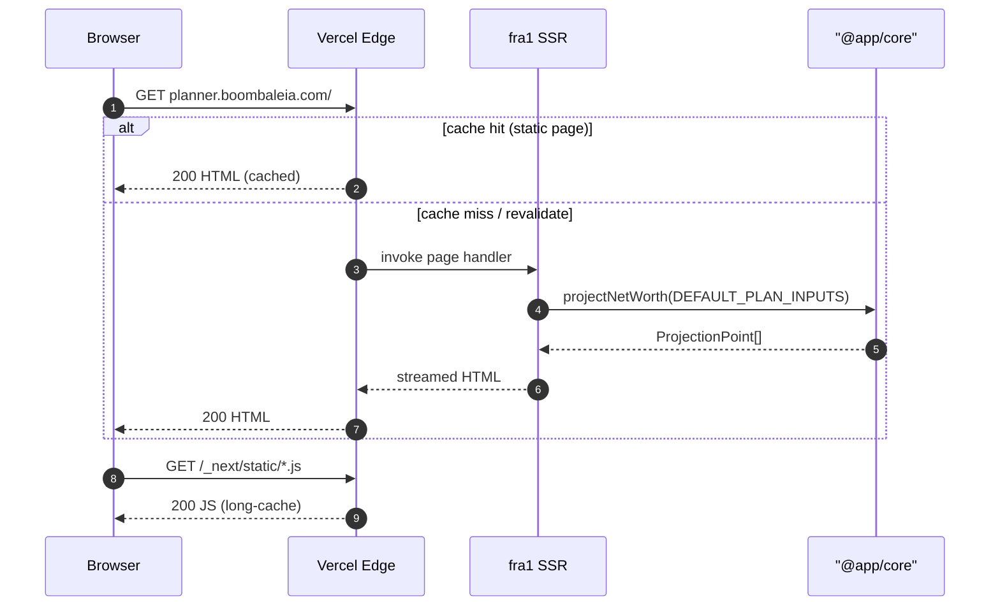

### 3.2 Sign-in flow <span class="badge badge-planned">PLANNED (M1)</span>

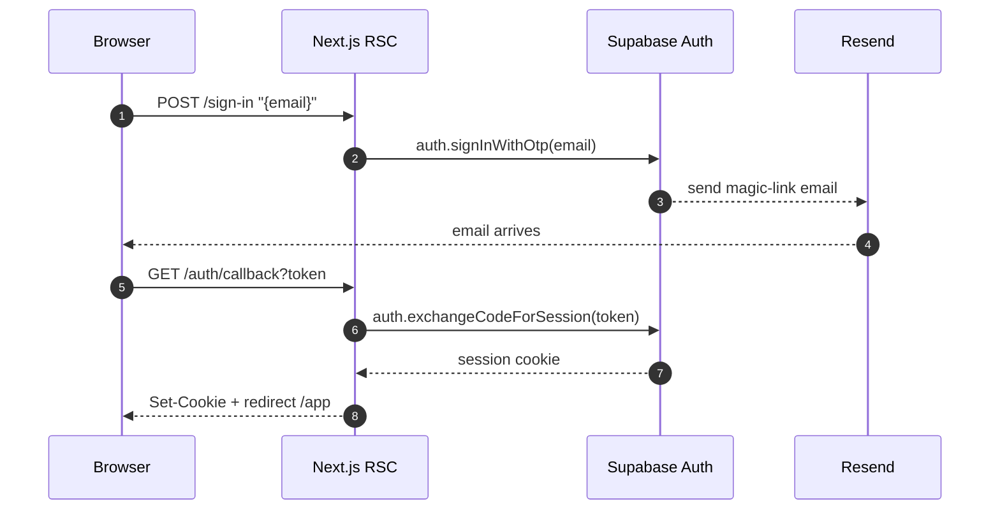

### 3.3 Save a scenario <span class="badge badge-planned">PLANNED (M1)</span>

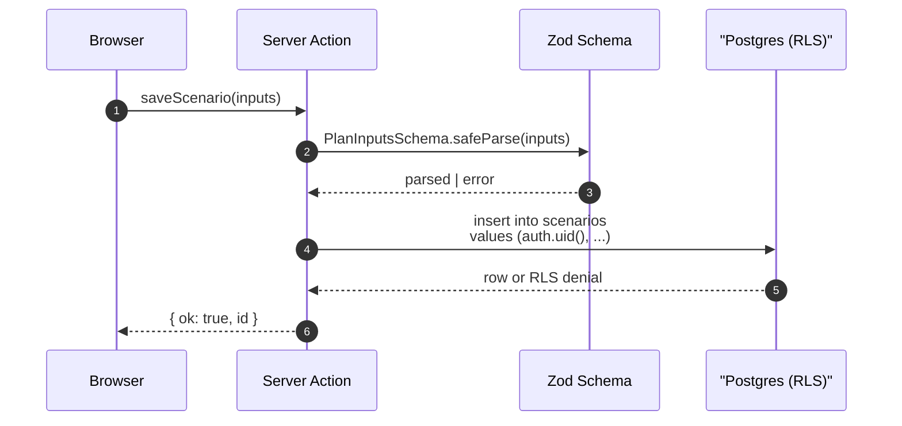

Note: the `auth.uid()` in the insert is enforced by a Postgres `check (owner_id = auth.uid())` constraint, not supplied by the client. A compromised client cannot forge ownership.

### 3.4 Run a Monte Carlo simulation <span class="badge badge-planned">PLANNED (M2)</span>

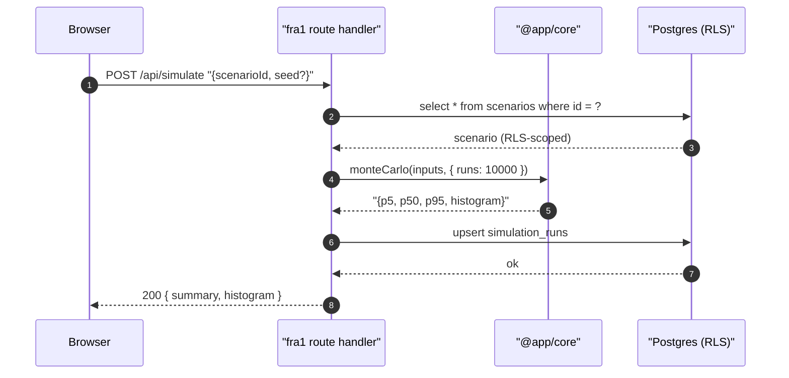

### 3.5 Stripe checkout + webhook <span class="badge badge-planned">PLANNED (M4)</span>

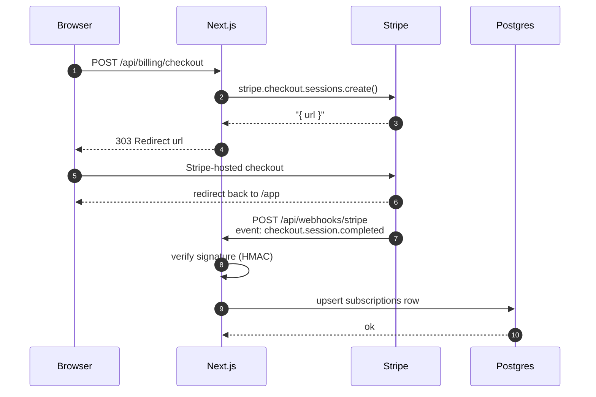

### 3.6 Client error → Sentry <span class="badge badge-dormant">WIRED-DORMANT</span>

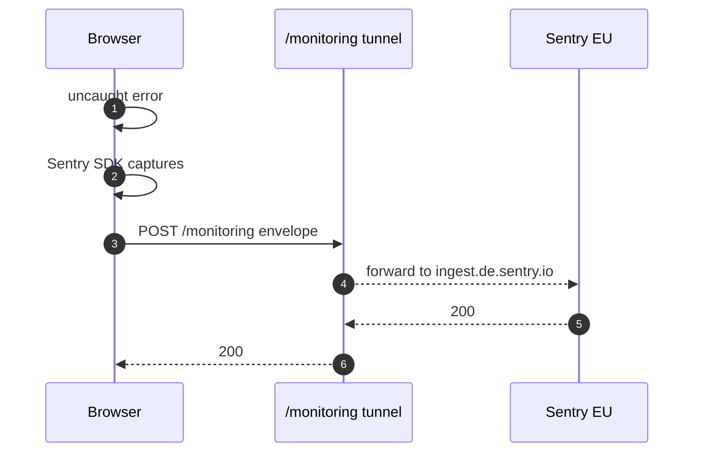

### 3.7 Client event → PostHog <span class="badge badge-dormant">WIRED-DORMANT</span>

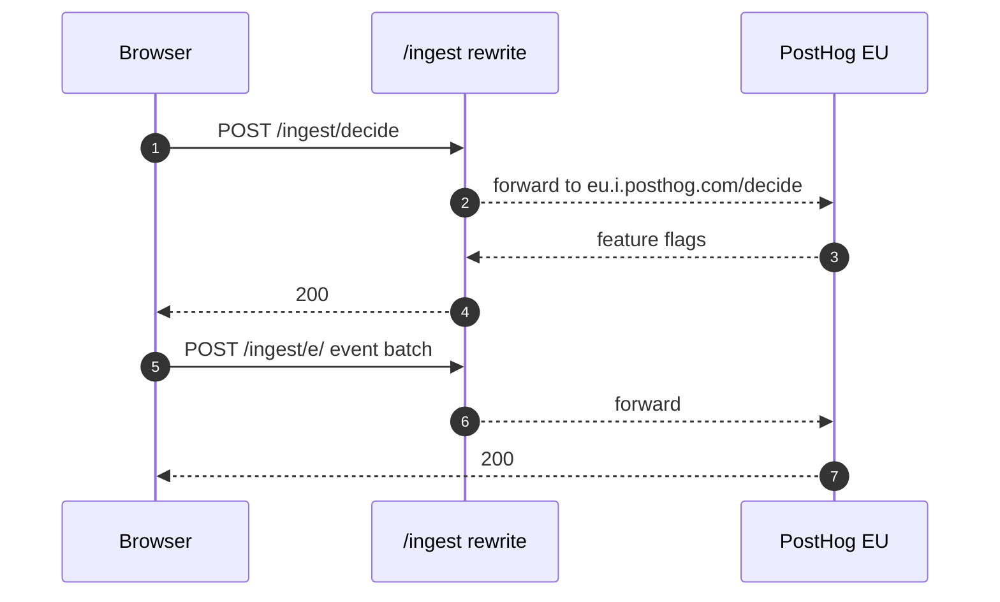

---

## Data model

### 4.1 Today <span class="badge badge-active">ACTIVE</span>

The only persistent data model today is `PlanInputs`, defined as a Zod schema in [`packages/core/src/planInputs.ts`](../packages/core/src/planInputs.ts) and persisted to the browser's localStorage by `app/src/features/planner/storage.ts`.

| Field | Type | Units | Constraints |
| --- | --- | --- | --- |
| `name` | string | — | any |
| `dateOfBirth` | string | YYYY-MM-DD | regex-checked |
| `startAssets` | number | currency | ≥ 0 |
| `startDebt` | number | currency | ≥ 0 |
| `debtInterestRate` | number | fraction | 0 … 0.20 |
| `debtRepaymentType` | enum | — | `"overTime"` \| `"inFine"` |
| `debtEndYear` | number | year | integer |
| `monthlySpending` | number | currency | ≥ 0 |
| `annualIncome` | number | currency | ≥ 0 |
| `retirementAge` | number | years | 18 … 100, integer |
| `nominalReturn` | number | fraction | −0.5 … 0.5 |
| `inflationRate` | number | fraction | −0.05 … 0.15 |
| `horizonYears` | number | years | 10 … 80 |
| `cashBalance` | number | currency | ≥ 0 |
| `nonLiquidInvestments` | number | currency | ≥ 0 |
| `otherFixedAssets` | number | currency | ≥ 0 |
| `nonLiquidLiquidityYear` | number | year | integer |
| `otherFixedLiquidityYear` | number | year | integer |
| `realEstateHoldings` | `RealEstateHolding[]` | — | stackable list of currently-owned properties (see below); default `[]` |
| `events` | `LifeEvent[]` | — | discriminated union (see below); default `[]` |

#### `RealEstateHolding`

A property the user owns today: a `value` (in today's money) plus an annual
`appreciationRate`, with an optional rental stream (`annualRentalIncome` in
today's money plus its own `rentalIncomeRate` annual growth). Each entry
compounds independently from year 0; the engine sums values into the same
`realEstate` bucket as any `RealEstateInvestmentEvent` contributions and adds
each holding's compounding rental into the netFlow alongside salary. No
purchase deduction (the asset is already owned). Each carries a stable `id`
(uuid) so the form can edit/remove a specific entry across renders.

| Field | Type | Units | Constraints |
| --- | --- | --- | --- |
| `id` | string | — | non-empty (uuid in practice) |
| `type` | literal | — | `"realEstateHolding"` |
| `value` | number | currency | ≥ 0 |
| `appreciationRate` | number | fraction | −0.05 … 0.10 |
| `annualRentalIncome` | number | currency / year | ≥ 0 (today's money) |
| `rentalIncomeRate` | number | fraction | −0.05 … 0.10 |

#### `LifeEvent` variants

A discriminated union keyed by `type`, persisted as part of `PlanInputs`. Each
variant carries a stable `id` (uuid) so the form can edit/remove a specific
entry across renders. There are three variants today; new variants drop in by
adding another schema to `LifeEventSchema` in `packages/core/src/planInputs.ts`.

##### `RealEstateInvestmentEvent` (`type: "realEstateInvestment"`)

A future property purchase: at `purchaseYear` the engine deducts
`purchaseAmount` (in today's money, inflated to the landing year) from the
liquid portfolio, seeds a per-event property bucket and rental stream, then
compounds both at the per-event rates each subsequent year. Behaves like a
`RealEstateHolding` but starts in the future and is funded from liquid
assets.

| Field | Type | Units | Constraints |
| --- | --- | --- | --- |
| `id` | string | — | non-empty (uuid in practice) |
| `type` | literal | — | `"realEstateInvestment"` |
| `purchaseAmount` | number | currency (today's money) | ≥ 0 |
| `purchaseYear` | number | year | integer |
| `appreciationRate` | number | fraction | −0.05 … 0.10 |
| `annualRentalIncome` | number | currency (today's money) | ≥ 0 |
| `rentalIncomeRate` | number | fraction | −0.05 … 0.10 |

##### `WindfallEvent` (`type: "windfall"`)

A one-off cash deposit landing in the liquid portfolio at year-end of `year`.
The amount is entered in today's money and the engine inflates it to the
landing year (same convention as `RealEstateInvestmentEvent.purchaseAmount`).
Multiple windfall events stack independently; each fires once when its `year`
matches the projection's calendar year.

| Field | Type | Units | Constraints |
| --- | --- | --- | --- |
| `id` | string | — | non-empty (uuid in practice) |
| `type` | literal | — | `"windfall"` |
| `amount` | number | currency (today's money) | ≥ 0 |
| `year` | number | year | integer |

##### `NewDebtEvent` (`type: "newDebt"`)

A future loan: at `startYear` the engine deposits `principal` (in today's
money, inflated to the landing year — same convention as `WindfallEvent` and
`RealEstateInvestmentEvent.purchaseAmount`) into liquid assets and starts
amortizing on its own schedule until `endYear`. `repaymentType: "overTime"`
uses the closed-form fixed annual payment that fully repays principal over
the (`endYear` − `startYear`) window; `"inFine"` pays interest only each
year and balloons the principal at `endYear`. The same year that disburses
principal also makes the first payment, so the year-end liquid impact is
(principal − first payment); subsequent years are pure amortization. Each
event runs independently of the top-level `startDebt` and of every other
new-debt event; the per-event balance is summed into the projection point's
`debt` field alongside the top-level debt balance.

| Field | Type | Units | Constraints |
| --- | --- | --- | --- |
| `id` | string | — | non-empty (uuid in practice) |
| `type` | literal | — | `"newDebt"` |
| `principal` | number | currency (today's money) | ≥ 0 |
| `interestRate` | number | fraction | 0 … 0.20 |
| `repaymentType` | enum | — | `"overTime"` \| `"inFine"` |
| `startYear` | number | year | integer |
| `endYear` | number | year | integer |

Derived output: `ProjectionPoint[]` with `{ year, age, netWorth, liquid, savings, otherAssets, realEstate, debt }`.

### 4.2 Target (M1 → M4) <span class="badge badge-planned">PLANNED</span>

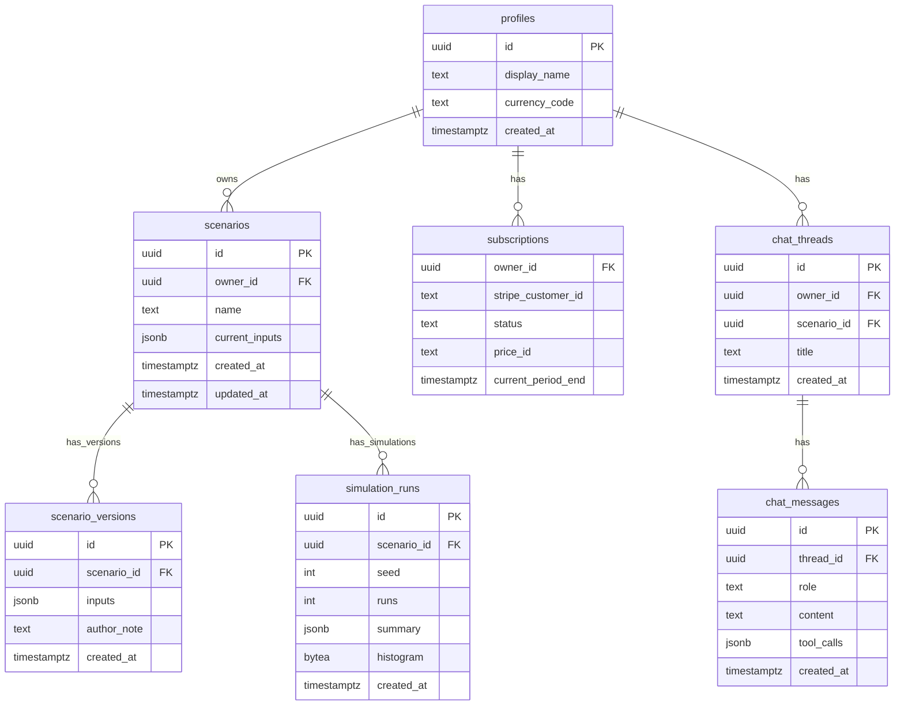

Every table has `owner_id` with an RLS policy scoping reads and writes to `auth.uid()`, except `chat_messages` which inherits ownership via its `thread_id` join (policy: `exists (select 1 from chat_threads t where t.id = thread_id and t.owner_id = auth.uid())`).

`scenario_versions` gives us cheap history/undo: every `updateScenario(...)` writes a new version row, and `scenarios.current_inputs` is a pointer to the most recent one.

`simulation_runs` lets Monte Carlo results be memoised: re-running with the same `(scenarioId, seed, runs)` returns the cached summary immediately.

---

## How a new feature is shipped

A high-level walkthrough of what happens when you develop a new feature. Twelve steps from idea to live.

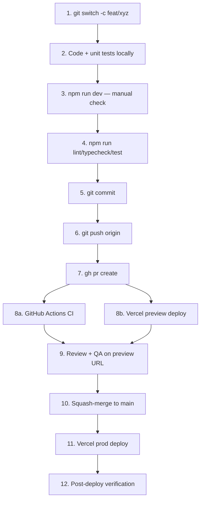

### Step by step

<div class="callout">
<strong>1. Branch off main.</strong>
<pre><code>git switch main &amp;&amp; git pull
git switch -c feat/descriptive-name</code></pre>
Short-lived branches only. Nothing lives on a feature branch longer than a few days.
</div>

<div class="callout">
<strong>2. Write code + tests locally.</strong> Feature-scoped code goes under <code>app/src/features/&lt;feature&gt;/</code>. Pure domain logic goes under <code>packages/core/src/</code>. Both sides get unit tests (<code>*.test.ts</code> / <code>*.test.tsx</code>) co-located with the source. New API routes live in <code>app/src/app/api/&lt;route&gt;/route.ts</code>.
</div>

<div class="callout">
<strong>3. Manual verification against <code>npm run dev</code>.</strong> Browse to <code>http://127.0.0.1:3000</code>. No Supabase / Stripe / Sentry / PostHog keys needed locally — the env schema supplies safe defaults and all external services are dormant.
</div>

<div class="callout">
<strong>4. Local gate before pushing.</strong>
<pre><code>npm run lint
npm run typecheck
npm test
# if the change touches a page or route:
npm run test:e2e</code></pre>
Same four commands CI runs. If they pass here, CI will almost always pass too.
</div>

<div class="callout">
<strong>5. Commit with a conventional message.</strong>
<pre><code>git add -A
git commit -m "feat(planner): add Monte Carlo panel

- Wires runMonteCarlo() from @app/core
- Adds histogram chart component
- Behind MONTE_CARLO_ENABLED flag"</code></pre>
Prefix with <code>feat</code>, <code>fix</code>, <code>chore</code>, <code>docs</code>, or <code>refactor</code>.
</div>

<div class="callout">
<strong>6. Push the branch.</strong>
<pre><code>git push -u origin HEAD</code></pre>
Upstream is set so subsequent pushes are just <code>git push</code>.
</div>

<div class="callout">
<strong>7. Open a pull request.</strong>
<pre><code>gh pr create --fill</code></pre>
Or use the GitHub UI. Branch protection rejects direct pushes to <code>main</code>.
</div>

<div class="callout">
<strong>8a. GitHub Actions runs CI.</strong> The <code>checks</code> job runs lint, typecheck, unit tests, and a production build (~2&nbsp;min). The <code>e2e</code> job runs the full Playwright suite against a real built Next.js server with browser cache (~1.5&nbsp;min on cache hit). Defined in <code>.github/workflows/ci.yml</code>.
</div>

<div class="callout">
<strong>8b. Vercel builds a preview.</strong> In parallel with CI, Vercel builds the same commit and posts a unique URL like <code>https://financial-planner-git-feat-xyz-lejeff.vercel.app</code>. The URL is pinned to the PR until the branch is deleted. Preview deploys get their own copies of <em>all</em> env vars so you can manually test paths that hit Supabase / Stripe / Sentry.
</div>

<div class="callout">
<strong>9. Review + QA.</strong> A teammate reviews the diff; you (or they) click through the preview URL. If CI is red, fix it. If review asks for changes, push more commits — the preview auto-updates on every push.
</div>

<div class="callout">
<strong>10. Squash-merge to <code>main</code>.</strong> One PR = one commit on <code>main</code>. Squash-merge preserves a clean linear history (enforced by branch protection).
</div>

<div class="callout">
<strong>11. Vercel deploys production.</strong> The squash-merge commit on <code>main</code> triggers an automatic production build that replaces <code>planner.boombaleia.com</code> when it finishes. Rollback is one click in the Vercel dashboard (previous deployments remain retrievable).
</div>

<div class="callout">
<strong>12. Post-deploy verification.</strong> Watch the Sentry dashboard for a minute for any new error types. Check PostHog's live events view if you shipped a user-facing change. Smoke-test the core flow manually. Done.
</div>

---

## Environments and configuration

### 6.1 The strict env split

All environment variables flow through two Zod-validated gateways:

- [`app/src/lib/env.ts`](../app/src/lib/env.ts) — public schema; exposes `NEXT_PUBLIC_*` variables and is safe to import from Client Components.
- [`app/src/lib/env.server.ts`](../app/src/lib/env.server.ts) — server-only schema, guarded by the `server-only` package. Importing it from a Client Component breaks the Next.js build at compile time.

Both schemas use the same helper:

```ts
const isDeployBuild = process.env.VERCEL === "1" || process.env.CI === "true";
const optional = (schema, devDefault) => (isDeployBuild ? schema : schema.default(devDefault));
```

Meaning: locally (`npm run dev`, `npm run build` without `CI=true`), safe placeholder defaults are used so you can work without a filled-in `.env.local`. On Vercel and in GitHub Actions, missing values throw at module load and fail the build loudly. This is how we proved the Vercel environment is correctly configured — the first deploy failed on a missing `NEXT_PUBLIC_APP_URL`, and fixing it unblocked the whole pipeline.

### 6.2 Where secrets live

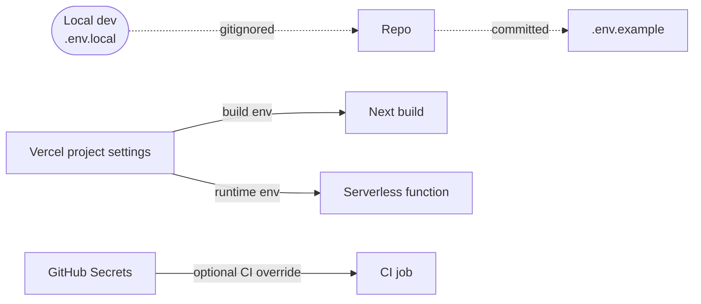

- Nothing secret is ever committed. `.env.example` is the only source-controlled enumeration of variables.
- Vercel is the authoritative store for production + preview environments.
- GitHub Actions uses well-formed placeholder values in [`.github/workflows/ci.yml`](../.github/workflows/ci.yml) — real secrets aren't needed to exercise the build + test paths.

### 6.3 Per-environment matrix

| Scope | Sentry | PostHog | Supabase | Stripe | Notes |
| --- | --- | --- | --- | --- | --- |
| Local dev | dormant | dormant | placeholder URL | placeholder key | Everything works without any keys |
| CI | dormant | dormant | placeholder URL | placeholder key | Strict env schema exercised |
| Vercel Preview | optional | optional | linked project | test mode | One preview deploy per PR |
| Vercel Production | on | on | linked project | live mode | Promote via merge to `main` |

---

## Security, privacy, data residency

### 7.1 Data residency

Every stateful hop lives in the EU:

- **Vercel functions** pinned to `fra1` (Frankfurt).
- **Supabase** project in `eu-central-1` (Frankfurt).
- **Sentry** ingest via `ingest.de.sentry.io` (Germany).
- **PostHog** on EU Cloud (`eu.i.posthog.com`, Germany).
- **Resend** sending from the EU region.

Edge-cached HTML is served from the closest POP to the user, but contains no user data — it's either the public landing/planner or a per-user page rendered on demand in `fra1`.

### 7.2 Tenant isolation

Supabase Postgres RLS is the single source of truth for "who can see what". There is no ad-hoc `where owner_id = $userId` in application code; the session's `auth.uid()` is what the policy checks, and the policy cannot be bypassed by a forgotten filter.

The service-role key (which bypasses RLS) is **server-only**, guarded by `server-only`, and used only for back-office operations like handling Stripe webhooks that need to write without a user session.

### 7.3 HTTP hardening

Already live on `planner.boombaleia.com` and verified in production:

- `Strict-Transport-Security: max-age=63072000` — 2-year HSTS
- `X-Frame-Options: DENY` — no one can iframe the app
- `X-Content-Type-Options: nosniff` — browsers can't MIME-sniff
- `Referrer-Policy: strict-origin-when-cross-origin`
- TLS is provisioned + renewed by Vercel, HTTP/2 throughout.

Headers come from [`app/next.config.ts`](../app/next.config.ts)'s `headers()` export.

### 7.4 PII inventory

| Service | Contains PII? | Mitigation |
| --- | --- | --- |
| Supabase Auth | email | Encryption at rest; EU region; soft-deletable via auth admin |
| Supabase Postgres | scenarios (may include name) | RLS isolation; per-user export/delete endpoint planned M1 |
| Sentry | stack traces only | Default PII scrubbing on; we never call `Sentry.setUser({ email })` |
| PostHog | anonymous id only | `persistence: "memory"`, `autocapture: false`, no user identification |
| Stripe | customer email + payment metadata | PCI offloaded to Stripe; customer portal for user self-service |
| Resend | email metadata | EU region; 30-day log retention on the free tier |
| LLM provider | prompts (scenario JSON) | No PII fields sent; opt-out of provider training where available |

### 7.5 Authentication & authorization (M1)

- **AuthN**: Supabase GoTrue email magic-link. HttpOnly cookie session. No long-lived JWT in the client.
- **AuthZ**: Postgres RLS. The app never decides who can see what — the database does.
- **CSRF**: Server Actions are POST-only, same-origin. Next.js adds an internal same-origin check by default in App Router.
- **Rate limiting**: Supabase Auth has built-in rate limiting on sign-in endpoints; we'll add a per-IP limiter in front of `/api/chat` in M3 (and `/api/webhooks/stripe` in M4) using Vercel's KV or Upstash Redis.

---

## Cost model

Free-tier first. Realistic first-paid-tier upgrade points listed below.

| Service | Free tier | Upgrade trigger | First paid tier (monthly) |
| --- | --- | --- | --- |
| **Vercel** | Hobby: 100 GB bandwidth, serverless invocations included | > 100 GB bw or > 1M function invocations | Pro: $20 |
| **Supabase** | Free: 500 MB DB, 50K MAUs, 2 GB bandwidth | > 50K MAUs or paused after 1 week inactivity | Pro: $25 |
| **Stripe** | Free to create, pay per transaction | Going live with paid subscribers | 2.9% + 30¢ per transaction |
| **Resend** | Free: 3K emails/month, 100/day | Transactional volume | Pro: $20 (50K emails) |
| **Sentry** | Developer: 5K errors + 10K traces | Team with real traffic | Team: $26 |
| **PostHog** | Free: 1M events, 5K replays | Event volume | Pay as you go: from $0.00005/event |
| **OpenAI** | N/A (pay per token) | AI chatbot launches | ~ $0.01–$0.03 per chat turn (scales with use) |
| **Gandi (domain)** | — | Annual renewal | ~ €18/year for `boombaleia.com` |

Full-stack M0 cost today: **€0/month + domain renewal**. First paid tier we're likely to cross is Supabase Pro once we're above 50K monthly active users or need Point-in-Time Recovery.

---

## Glossary and further reading

### Glossary

- **App Router** — Next.js 13+ routing system based on the `app/` directory. Uses React Server Components by default.
- **Edge** — Vercel's global CDN POPs. Serves static content and runs Edge runtime code close to the user.
- **fra1** — Vercel's region code for Frankfurt, Germany. Where our serverless functions execute.
- **RLS** — Row-Level Security. Postgres feature that attaches a security predicate to every query on a table.
- **Server Action** — a function marked `"use server"` that runs on the server but is called from a client component as if it were local.
- **Tunnel route** — a first-party URL on our domain that proxies to a third-party ingest endpoint to bypass ad blockers (`/monitoring` for Sentry, `/ingest` for PostHog).
- **WIRED-DORMANT** — code path is shipped and correct, but the service stays inert until its credential appears in env.

### Further reading

- [`README.md`](../README.md) — top-level project intro + scripts
- [`infra/m0-deploy-checklist.md`](../infra/m0-deploy-checklist.md) — step-by-step bootstrap of the whole stack
- [`infra/vercel-deploy.md`](../infra/vercel-deploy.md) — Vercel setup + custom domain
- [`infra/supabase-setup.md`](../infra/supabase-setup.md) — local CLI + migrations workflow
- [`infra/launch-checklist.md`](../infra/launch-checklist.md) — pre-launch sanity items
- [`app/src/lib/env.ts`](../app/src/lib/env.ts), [`env.server.ts`](../app/src/lib/env.server.ts) — env schemas (the compile-time safety net)
- [`vercel.json`](../vercel.json) — region pinning + build config
- [`.github/workflows/ci.yml`](../.github/workflows/ci.yml) — CI pipeline definition

<p class="small">Last regenerated: run <code>npm run docs:build</code> to rebuild both <code>docs/architecture.pdf</code> and <code>docs/architecture.html</code> from this markdown source.</p>
