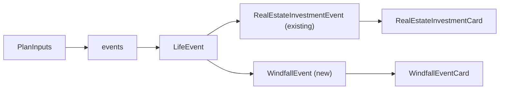

# Windfalls as life events

Replace the single `windfallAmount`/`windfallYear` scalars with a stackable `WindfallEvent` variant in the existing `LifeEvent` discriminated union. Default is an empty array; a `+ Add Windfall` button appends a fresh card. No localStorage migration — old persisted windfall scalars leak through the `...parsed` spread in [`storage.ts`](../../app/src/features/planner/storage.ts) but are dropped by TypeScript (they're not in the new `PlanInputs` shape) and never read by the form or projection. Matches the clean break taken by the Real Estate Holdings refactor (PR #23, commit `c9618a8`).

## Why this fits cleanly

The architecture for this already exists. `LifeEventSchema` in [`packages/core/src/planInputs.ts`](../../packages/core/src/planInputs.ts) is a `z.discriminatedUnion("type", [...])` and the projection engine already keeps a per-event `Map` keyed on `event.id` for `RealEstateInvestmentEvent`. Adding a second variant is mostly schema + a small loop in [`projection.ts`](../../packages/core/src/projection.ts) + new card UI.

Storage already does the right thing — yesterday's RE Holdings ship added defensive parsing in [`storage.ts`](../../app/src/features/planner/storage.ts):

```ts
const EventsSchema = z.array(LifeEventSchema);
const HoldingsSchema = z.array(RealEstateHoldingSchema);
```

Because `EventsSchema` references `LifeEventSchema` (the union itself), extending the union with `WindfallEventSchema` automatically picks up windfall events on load with no `storage.ts` changes needed. We just need to add a parallel test case alongside the existing `realEstateInvestment` round-trip in [`storage.test.ts`](../../app/src/features/planner/storage.test.ts).



## 1. Schema — `packages/core/src/planInputs.ts`

- Add `WindfallEventSchema` next to `RealEstateInvestmentEventSchema`:
  - `id: z.string().min(1)`
  - `type: z.literal("windfall")`
  - `amount: z.number().finite().nonnegative()`
  - `year: z.number().int()`
- Extend the union: `LifeEventSchema = z.discriminatedUnion("type", [RealEstateInvestmentEventSchema, WindfallEventSchema])`.
- Export `WindfallEvent` type.
- Remove `windfallAmount` and `windfallYear` from `PlanInputsSchema` and from `DEFAULT_PLAN_INPUTS`.
- Add `makeDefaultWindfallEvent()` factory: `{ id: crypto.randomUUID(), type: "windfall", amount: 0, year: new Date().getFullYear() + 5 }` (matches today's default windfall year offset).

## 2. Projection — `packages/core/src/projection.ts`

- Filter once: `const windfallEvents = input.events.filter((e): e is WindfallEvent => e.type === "windfall")`.
- Replace the existing single-windfall block with a loop over `windfallEvents`; each fires when `startYear + i === event.year && event.amount > 0`, depositing `event.amount * inflator` into `assets`. Same year-end / inflator semantics as today, just iterated.
- No state map needed — windfalls have no per-year carry, just a one-shot deposit.

## 3. Form — `app/src/features/planner/PlannerForm.tsx`

- Drop `"windfallAmount"` from `AmountKey`, drop `"windfallYear"` from `SliderKey`, and delete the `WINDFALL_YEAR_SLIDER` spec plus the inline windfall amount/year fields inside the Life Events `CollapsibleCategory`.
- Add a `WindfallEventCard` component modeled on `RealEstateInvestmentCard` but minimal: `legend` "Windfall N", a `CurrencyField` for amount (max 100M), a `SliderRow` for year using a per-card spec (min `currentYear`, max `currentYear + MAX_HORIZON_YEARS`). The Year slider's helper mirrors the RE investment card: when amount > 0, surface the inflation-adjusted nominal deposit (e.g. `€11,041 in 5 years`); blank-slate cards fall back to just the relative phrase. Plus a `Remove` button.
- Add `addWindfallEvent` handler analogous to `addRealEstateInvestment`.
- In the Life Events section, render in this order: existing windfalls (`+ Add Windfall` button below them), then existing RE investments (`+ Add Real Estate Investment` button below them). Both buttons use `ACCENT.lifeEvents`.
- Note: `RealEstateInvestmentCard`'s `purchaseYearSpec` previously used `key: "windfallYear"` (metadata-only and not wired to anything). Renamed to a card-local string `"reInvestmentPurchaseYear"` so the rename in the SliderKey union doesn't leave a stale literal.
- Update `summarizeLifeEvents`:
  - `windfalls = events.filter(e => e.type === "windfall")`, `reCount = events.filter(e => e.type === "realEstateInvestment").length`
  - One windfall with `amount > 0` → `Windfall $50K in 2031` (preserves the single-windfall line the form had before it became list-based).
  - One windfall with `amount = 0` → `1 windfall`.
  - More than one windfall → `2 windfalls` (or N).
  - Combine with `1 real estate investment` etc. as before.
  - `None scheduled` when both are empty.

## 4. Tests

- [`packages/core/src/planInputs.test.ts`](../../packages/core/src/planInputs.test.ts): add `WindfallEventSchema` validation tests (valid case, missing id, empty id, wrong type literal, negative amount, non-finite amount, non-integer year). Extend `LifeEventSchema` test to cover both variants. Add `makeDefaultWindfallEvent` describe block (unique id, year = currentYear + 5, amount = 0, type discriminator). Add "accepts a plan with one windfall event" and "accepts a plan mixing windfall and real estate investment events" cases. Update the `RealEstateInvestmentEventSchema` "wrong type literal" test to use `"lottery"` instead of `"windfall"` (which is now a valid sibling literal).
- [`packages/core/src/projection.test.ts`](../../packages/core/src/projection.test.ts):
  - Drop `windfallAmount: 0, windfallYear: 0` from `BASE_INPUTS`; `events: []` already there.
  - Add a `makeWindfallEvent` factory mirroring `makeReEvent`.
  - Rewrite the existing windfall block: each test now passes `events: [makeWindfallEvent({ amount: …, year: … })]`. Same six assertions (deposit at year, compounds afterward, ignores out-of-horizon, zero-amount no-op, lands in assets not cash, inflation).
  - Add a new test: two windfall events in different years both deposit independently.
- [`app/src/features/planner/PlannerForm.test.tsx`](../../app/src/features/planner/PlannerForm.test.tsx): rewrite the windfall-related tests to drive the new card. Add a dedicated `Windfall events` describe block: empty default with `+ Add Windfall` button visible, click adds a card with default values, two cards stack independently, update one without affecting siblings, Remove specific card, multi-windfall summary collapses to `2 windfalls`, render order (windfalls before RE investments), inflation-adjusted helper text, blank-amount fallback to bare relative phrase.
- [`app/src/features/planner/storage.test.ts`](../../app/src/features/planner/storage.test.ts): mirror the existing "preserves a valid stored events array on load" case with a `WindfallEvent` payload, plus a "preserves a mix of windfall and realEstateInvestment events" case. The malformed-events fallback test already exercises the union's failure path so no change there.

## 5. Docs (per `documentation.mdc`)

- [`docs/architecture.md`](../architecture.md) §4.1: drop the `windfallAmount` / `windfallYear` rows; under "LifeEvent variants", bump the count from "one variant" to "two", and add a `##### WindfallEvent (type: "windfall")` subsection with the new field table.
- Run `npm run docs:build` to regenerate `docs/architecture.pdf` and `docs/architecture.html`; commit all three together.
- After ship: archive this plan to `docs/plans/2026-04-28-windfalls-as-life-events.md` and bump the index in [`docs/plans/README.md`](./README.md).

## Ship workflow

1. Branch, implement, run lint + typecheck + test locally and report.
2. Pause for manual verification in `npm run dev`. Things to exercise:
   - Fresh load (clear localStorage) — Life Events shows `None scheduled` and only `+ Add Windfall` / `+ Add Real Estate Investment` buttons.
   - Click `+ Add Windfall` twice — two cards stack with independent amount/year fields.
   - Year slider helper shows the inflation-adjusted future value (e.g. `€11,041 in 5 years` at 2% inflation, `10,000` amount, year + 5) and updates live as the slider moves.
   - Set amounts and years that fall inside / outside the horizon — chart updates as expected.
   - Remove the middle of three windfalls — the other two are unaffected and the chart stays consistent.
   - Reload the page — windfalls persist via localStorage.
   - An existing saved plan with old `windfallAmount`/`windfallYear` scalars loads cleanly with zero windfalls (clean-break confirmed).
3. Wait for explicit go-ahead before commit / push / PR / merge.
