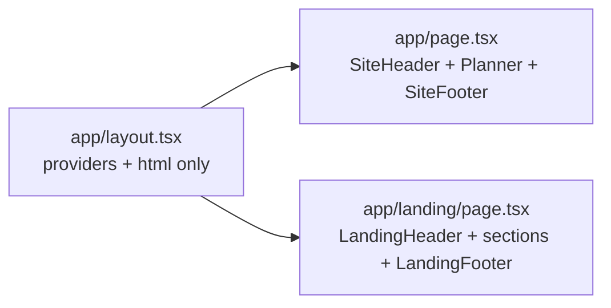

## Goal

- Planner stays at `/` (zero behavioural change for the live app).
- New marketing landing lives at `/landing` on `main`, behind `robots: noindex`, reachable via a discreet "Preview new landing" link in `SiteFooter`.
- `landing-page-mockup` branch (and its v0 sandbox) is retired after the fold.

## Why this shape

The landing branch put `SiteHeader`/`SiteFooter` into individual page files (instead of the root `layout.tsx`) so each route can pick its own chrome. We adopt the same pattern at our scale (one page becomes two). That gives us per-route chrome without introducing route groups or `usePathname` hacks.

## File changes (on a new branch from `main`)

- `app/src/app/layout.tsx` — remove `SiteHeader`/`SiteFooter` imports and renders. Keep providers, fonts, html/body. Add `bg-[var(--cream)]` to the `<html>` className (matches landing branch and is harmless for planner). Drop the now-unused chrome wrapper `
`.
- `app/src/app/page.tsx` — wrap existing `PlannerHero` + `PlannerPage` with `<SiteHeader />` and `<SiteFooter />` (mirrors the landing branch's `app/planner/page.tsx`). No content changes.
- `app/src/app/landing/page.tsx` (new) — copy the landing branch's `app/page.tsx` body verbatim. Add route-level `metadata` with marketing title and `robots: { index: false, follow: false }`.
- `app/src/components/landing/*.tsx` (new, 7 files) — copy as-is from the worktree, with one mechanical edit: rewrite internal links so they fit main's URL shape:
  - `LandingHeader.tsx`: 3 occurrences of `href="/planner"` → `href="/"`; logo `Link href="/"` → `Link href="/landing"`
  - `LandingHero.tsx`: 1 occurrence of `href="/planner"` → `href="/"`
  - `FinalCTA.tsx`: 1 occurrence of `href="/planner"` → `href="/"`
  - `LandingFooter.tsx`: 1 `href="/planner"` → `href="/"`; logo `Link href="/"` → `Link href="/landing"`
- `app/src/components/SiteFooter.tsx` — add a discreet "Landing preview" `<li>` to the Product list pointing to `/landing` (same style as the existing "Planner" / "How it works" links).

No CSS additions are needed — the landing branch's `globals.css` is actually older than `main`'s (we already shipped the `.range-slider-*` rules on `main`).

## Tests

- No new component tests; the landing components are presentational marketing markup. Existing tests should be unaffected:
  - `PlannerPage.test.tsx` renders `PlannerPage` directly, not the route.
  - `SiteHeader`/`SiteFooter` aren't covered by tests today.
- Run the standard `lint` + `typecheck` + `test` triad to confirm 377/377 stays green.

## Docs

- `docs/architecture.md` §2.2 — add `app/src/app/landing/page.tsx — marketing landing preview (noindex)` to the routes bullet list, alongside the existing `app/src/app/page.tsx` line. Then `npm run docs:build` and commit the regenerated `architecture.html` + `architecture.pdf`.
- `README.md` — no change required (no new dep, no new script).
- `docs/plans/` — archive this plan as `2026-04-30-fold-landing-into-main.md` and bump the count in `docs/plans/README.md`.

## Manual verification (paused before ship)

After local checks pass, you'll spot-check on `npm run dev` (single dev server on `:3000`):

1. `http://localhost:3000/` — planner renders with the existing `SiteHeader` + `SiteFooter`. Identical to today.
2. `http://localhost:3000/landing` — landing renders with `LandingHeader` + sections + `LandingFooter`. CTAs ("Get started free", "Try it free") and the footer's planner link all jump to `/`.
3. Footer on `/` has a new "Landing preview" link that takes you to `/landing`.
4. View source on `/landing` and confirm `<meta name="robots" content="noindex,nofollow" />`.

## Ship + cleanup (after your approval)

1. Branch `feat/fold-landing-into-main`, commit, push, open PR, wait for CI green, squash-merge.
2. Delete remote branch `landing-page-mockup` and the `git worktree` at `/Users/jeffmarois/financial-planner-landing` (worktree remove + branch -D). Stop the `:3001` dev server.
3. Delete the local `feat/fold-landing-into-main` branch.

## Rollback

Single squash commit → reverting the PR removes `/landing` and the `SiteFooter` link. The `layout.tsx` ↔ `page.tsx` chrome shuffle is mechanical, so the revert is clean.
